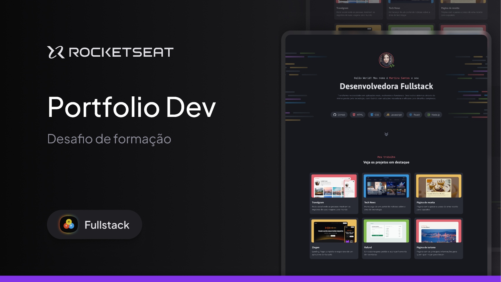

# Portfólio Dev

Projeto realizado durante o curso Full-Stack da Rocketseat

## 📌 Descrição

Neste desafio, você vai desenvolver um portfólio em HTML e CSS, com layout moderno e que apresenta sua identidade como desenvolvedor(a), suas principais habilidades e projetos em destaque. O portfólio contará com uma seção de apresentação personalizada, tags de tecnologias que identificam sua stack e cards de projetos que exibem imagem, título e descrição.

## 🛠 Tecnologias

O projeto foi construído com:

- HTML5
- CSS3

---

